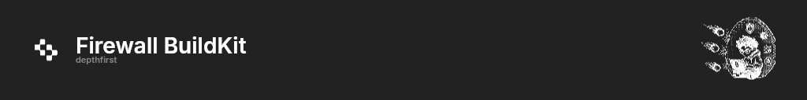

<p align="center"></p>

# Firewall BuildKit

A [custom Dockerfile frontend](https://docs.docker.com/build/buildkit/frontend/) for DepthFirst Device Firewall. Add one parser directive to a Dockerfile and `docker build` sends package downloads through the firewall.

```dockerfile
# syntax=ghcr.io/patcherai/firewall-buildkit:1

FROM node:24-alpine
WORKDIR /app
COPY package*.json ./
RUN npm ci
COPY . .
```

Pin the frontend image by digest in production. A tag is mutable and runs inside the BuildKit frontend sandbox.

The frontend rewrites the Dockerfile inside BuildKit, then delegates to the digest-pinned Dockerfile 1.24.0 frontend. Local, Git, HTTP, Compose, and Bake contexts stay BuildKit inputs.

## CI

Pass the firewall API key as a BuildKit secret. Docker reads the same-named environment variable:

```sh
export DF_FIREWALL_API_KEY='...'
docker build --secret id=DF_FIREWALL_API_KEY -t example/app .
```

A frontend cannot read host or CI environment variables. Do not pass the key as a build argument. Every network-enabled `RUN` requires this secret unless the local Device Firewall CA fingerprint is set, so a forgotten flag fails closed.

With `docker/build-push-action`:

```yaml
- uses: docker/build-push-action@v7
  env:
    DF_FIREWALL_API_KEY: ${{ secrets.DF_FIREWALL_API_KEY }}
  with:
    context: .
    secret-envs: DF_FIREWALL_API_KEY=DF_FIREWALL_API_KEY
    tags: example/app
```

## Local Device Firewall

On a local Docker Desktop builder with Device Firewall healthy, pass the public CA and its SHA-256 fingerprint:

```sh
docker build \
  --secret id=DF_FIREWALL_CA,src=/absolute/path/to/ca.crt \
  --build-arg DF_FIREWALL_CA_SHA256=<lowercase-sha256> \
  .
```

The fingerprint opts the build into CA installation and busts cache when the CA rotates. The certificate is public and may land in the image. The API key is not accepted as a build argument; the device daemon rewrites registry traffic and injects authentication.

## Package managers

For each Linux stage the frontend can:

- install the Device Firewall CA into Debian, Ubuntu, Alpine, and RHEL-family trust stores
- expose that CA to Node, Python, uv, Ruby/Bundler, Git, and other OpenSSL clients on network-enabled `RUN`s
- point these clients at Device Firewall registries for that `RUN`
- keep the API key and generated client config off image layers by writing them on a per-`RUN` tmpfs

| Client | Automatic | Route | Auth | Notes |
| --- | --- | --- | --- | --- |
| npm | Yes | `/npm/` | npmrc `_authToken` | `NPM_CONFIG_REGISTRY` overrides project `.npmrc` registry. Other npmrc keys are merged. |
| pnpm | Yes | `/npm/` | same npmrc | Uses npm config and `NPM_CONFIG_*`. |
| Yarn Classic | Yes | `/npm/` | same npmrc | Yarn v1 reads npmrc. |
| Yarn Berry | Yes | `/npm/` | `YARN_NPM_AUTH_TOKEN` | `npm:` protocol only. `git:`, `github:`, `patch:`, and `portal:` are unchanged. |
| pip | Yes | `/pypi/simple/` | URL token | `PIP_INDEX_URL`. Extra-index URLs in pip.conf are not rewritten. |
| uv | Yes | `/pypi/simple/` | URL token | `UV_DEFAULT_INDEX` and `UV_INDEX_URL`. |
| Poetry | Partial | `/pypi/simple/` | HTTP basic for source `firewall` | Mark a source named `firewall` primary in `pyproject.toml`. Poetry has no env var that replaces the package source URL. |
| Go modules | Yes | `/go` | URL token | `GOPROXY`. `GOSUMDB=off` for that `RUN`. |
| gem | Yes | `/rubygems` | URL token | `GEMRC` lists the firewall source for that `RUN`. |
| Bundler | Yes | `/rubygems` | `BUNDLE_FIREWALL__DEPTHFIRST__COM` | Mirrors `https://rubygems.org` only. Other Gemfile sources are unchanged. |
| Cargo | No | | | Not configured. |
| Maven / Gradle | No | | | Not configured. |
| NuGet | No | | | Not configured. |
| Composer | No | | | Not configured. |
| Bun | No | | | Not configured. |
| Pipenv | No | | | Not configured. If Pipenv invokes pip, `PIP_INDEX_URL` still applies. |
| Conda | No | | | Not configured. |

Existing user-level npmrc, Bundler config, `NODE_EXTRA_CA_CERTS`, and `SSL_CERT_FILE` are merged rather than replaced.

`RUN --network=none` is unchanged. Local Device Firewall builds without `DF_FIREWALL_API_KEY` rely on the device daemon to rewrite registry traffic; the rows above describe CI auto-configuration when the API key secret is present.

## Supported Dockerfiles

- Linux stages with POSIX `/bin/sh`
- shell-form and JSON-form `RUN`
- multiline instructions
- multi-stage and multi-platform builds
- existing `RUN --mount`, `--network`, `--security`, and `--device` options
- the stable Dockerfile 1.24.0 feature set

The frontend fails closed for Windows stages, shell-less stages that need a CA or protected `RUN`, `RUN` heredocs, an unreadable CA store, and use of the reserved stage name `depthfirst_assets`. A `scratch` or distroless final stage without a `RUN` is usable in CI because no CA step is emitted unless the local CA fingerprint is supplied.

The API-key secret is visible to network-enabled `RUN` commands and their child processes, including package-manager lifecycle scripts. Registry URLs for pip, uv, Go, and RubyGems carry the key as HTTP Basic credentials for the lifetime of the step. Treat Dockerfiles and install scripts as trusted CI code, use a scoped firewall key, and do not print the environment or package-manager configuration.

References: [custom Dockerfile frontends](https://docs.docker.com/build/buildkit/frontend/), [BuildKit secrets](https://docs.docker.com/build/building/secrets/), and [GitHub Actions secret sources](https://docs.docker.com/build/ci/github-actions/secrets/).
